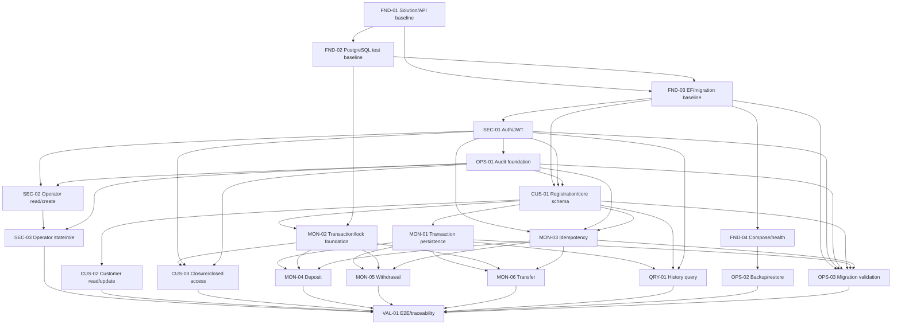

# Phase 4 実装Issue分割計画

- Status: Draft
- Date: 2026-08-02
- Parent / Control Issue: #3
- Planning Issue: #28
- Independent Review Issue: #29
- Required gate: Architecture Ready = `PASS`
- Target gate: Implementation Ready = `NOT EVALUATED`
- Approved specification merge: `8df8caee4afcacad2c2d05b3ae39bf94217ee12b`
- Accepted architecture merge: `bb997c46e3378fd03c9aeb1dc2e59a233e3ac1c0`

## 1. 目的

承認済み製品仕様とAccepted ADR-0001〜ADR-0009を、AIエージェントが一件ずつ実装・検証・独立レビューできるIssueへ分割する。

この文書は実装Issueそのものではない。候補Issue、所有責任、依存関係、追跡関係、検証戦略を先に固定し、独立レビュー後にGitHub Issueを作成するための計画成果物である。

## 2. 調査した公式資料

### GitHub Issues

- GitHub Issuesは大きな作業をsub-issueへ分割し、issue dependenciesでblock関係を表現できる。
- 親Issueとsub-issueの進捗はGitHub Projectsでも利用できる。
- 本プロジェクトではIssue #28を親とし、最終leaf Issueを直接sub-issueとして接続する。
- 21件前後であれば中間epic Issueは作らず、prefixとlabelでworkstreamを区別する。不要な階層を増やさない。

参考:

- https://docs.github.com/en/issues/tracking-your-work-with-issues/learning-about-issues/about-issues
- https://docs.github.com/en/issues/tracking-your-work-with-issues/using-issues/adding-sub-issues
- https://docs.github.com/en/enterprise-cloud@latest/issues/tracking-your-work-with-issues/using-issues/creating-issue-dependencies

### Backlog refinement

- 作業項目は、実施者が内容と完了条件を理解でき、一回の実装・レビュー単位でDoneにできる粒度までrefineする。
- 本計画では日数やLOCの固定上限を設けない。目的、責任、差分範囲、検証方法が一つのレビュー単位に収まるかで判断する。

参考:

- https://scrumguides.org/scrum-guide.html

### .NET / EF Core testing

- ASP.NET Core integration testはdatabase、file system、network等を含む重要な境界に集中させる。
- 通常ロジックの全組合せをintegration testへ重複させず、unit testで十分なものはunit testを使う。
- EF Coreのprovider固有挙動、raw SQL、transaction、constraint、migrationは実際に採用するdatabaseで試す。
- EF Core InMemory providerまたはSQLiteをPostgreSQLのrow lock、advisory lock、constraint、migration検証の代替にしない。

参考:

- https://learn.microsoft.com/en-us/aspnet/core/test/integration-tests?view=aspnetcore-10.0
- https://learn.microsoft.com/en-us/ef/core/testing/choosing-a-testing-strategy
- https://learn.microsoft.com/en-us/ef/core/testing/testing-with-the-database

### PostgreSQL concurrency

- row lockはtransaction終了まで保持される。
- 複数objectをlockする処理は一貫した順序で取得することがdeadlock回避の基本である。
- transaction-level advisory lockはtransaction終了時に自動解放される。

参考:

- https://www.postgresql.org/docs/current/explicit-locking.html

## 3. 分割判断

### 3.1 採用する基本形

1. 利用者から結果を観測できる機能はvertical sliceで分ける。
2. 複数sliceを本当にblockする共通基盤だけhorizontal Issueにする。
3. 一つのDB object、共通contract、migration責任には一つのprimary ownerを置く。
4. 各feature Issueが自身のunit / API / PostgreSQL integration testを持つ。
5. 最終E2E Issueは不足テストの代替にせず、接続確認とtraceability closureだけを担当する。
6. 各Issueは原則として一つのDraft PRと一回のAgent B独立レビューで完了する。
7. 実装順序とmerge順序をdependencyとして明示する。

### 3.2 採用しない分け方

- API層、Application層、Domain層、Infrastructure層を別々のIssueとして作る。
- 全schemaを一つの巨大initial migration Issueで作る。
- transaction、row lock、idempotencyを各featureが個別実装する。
- 機能Issueではテストせず、最後の横断test Issueへ丸投げする。
- Docker、backup、migration rollbackを業務featureへ混在させる。
- 形式的にIssue数を減らすため、登録・入出金・振込を一つのIssueへ統合する。

## 4. 候補Issue一覧

最終候補は21件とする。番号は計画上の安定IDであり、GitHub Issue番号ではない。

| ID | 候補Issue | 種別 | Primary responsibility |
| --- | --- | --- | --- |
| FND-01 | Solution・API・品質基盤 | Enabler | project境界、共通REST error、TimeProvider、correlation、JSON logging、build/test CI |
| FND-02 | PostgreSQL integration test基盤 | Enabler | Testcontainers、実PostgreSQL fixture、test isolation |
| FND-03 | EF Core・migration実行基盤 | Enabler | DbContext、explicit migrator、migration history、model drift検査 |
| FND-04 | Docker Compose・health基盤 | Enabler | API/PostgreSQL local runtime、image pin、live/ready health |
| SEC-01 | 認証・JWT・authorization-state | Vertical security capability | Identity、login、JWT、current-state validation、401/403 |
| SEC-02 | Operator一覧・詳細・作成 | Vertical security capability | 管理者向けquery/create、固定role初期割当 |
| SEC-03 | Operator状態・role変更・管理者保護 | Vertical security capability | enable/disable、role change、last-admin、self-disable、concurrency |
| OPS-01 | Audit Log基盤 | Cross-cutting enabler | AuditLog table、append-only trigger、writer、fail-closed contract |
| CUS-01 | Customer登録・Account自動開設 | Vertical capability + core schema | Customer/Account aggregate、YenAmount、account number sequence、atomic registration |
| CUS-02 | Customer参照・更新 | Vertical capability | customer query/update、email normalization/uniqueness |
| CUS-03 | Customer/Account解約・解約後制御 | Vertical capability | closure transition、closed-state access、closure-money concurrency |
| MON-01 | Transaction永続化・不変性 | Cross-cutting money enabler | Transaction table、4 types、transfer metadata、append-only trigger |
| MON-02 | Transaction境界・Account row lock基盤 | Cross-cutting money enabler | explicit transaction orchestration、FOR UPDATE、lock order、conflict mapping |
| MON-03 | 冪等性基盤 | Cross-cutting money enabler | digest、advisory lock、fixed result、replay、non-consuming errors |
| MON-04 | 入金 | Vertical capability | deposit endpoint/use case、balance/post-balance、audit/idempotency integration |
| MON-05 | 通常出金・全額出金 | Vertical capability | withdrawal variants、balance rules、audit/idempotency integration |
| MON-06 | 口座間振込 | Vertical capability | two-account atomic transfer、dual history、transfer ID、counterparty fields |
| QRY-01 | 取引履歴照会 | Vertical query capability | all-history query、ordering、empty result、role/closed access |
| OPS-02 | Backup・restore | Operations | pg_dump/pg_restore scripts、artifact protection、clean restore evidence |
| OPS-03 | Migration upgrade・rollback検証 | Operations | empty/previous upgrade、model drift、safe Down/restore、compatibility |
| VAL-01 | API E2E・traceability closure | Final validation | cross-capability smoke、requirements/AC coverage audit、no missing contract |

## 5. 候補Issue詳細

### FND-01 Solution・API・品質基盤

**Purpose**

`.NET 10` modular monolithのproject境界と、後続Issueが共通利用するAPI・品質契約を作る。

**Owns**

- solutionとAPI/Application/Domain/Infrastructure/Tests project
- nullable、analyzer、format/build設定
- 共通error envelopeとerror mapping extension point
- injected `TimeProvider`
- correlation ID
- JSON console loggingの基礎
- `dotnet build` / `dotnet test` CI
- approved major内のexact package version pin

**Out of scope**

- PostgreSQL、EF model、Identity、business endpoint、Docker Compose

**Verification**

- build/test CI
- error envelope contract unit/API test
- secretを設定・logへ含めない静的確認

**Trace**

- Specification §2.3、§16、AC-ERR-001
- ADR-0001、ADR-0008 technical logging部分

### FND-02 PostgreSQL integration test基盤

**Purpose**

PostgreSQL固有挙動を再現可能に検証する共通test fixtureを作る。

**Owns**

- PostgreSQL 18 Testcontainers fixture
- test database作成・cleanup・isolation
- integration test categoryと実行方法
- parallel実行方針
- PostgreSQL image digest pin

**Out of scope**

- business table、migration、feature test内容

**Verification**

- 複数testが相互干渉しない
- database lifecycle failure時に明確にfailする
- InMemory/SQLiteをprovider-specific testへ使用しない

**Trace**

- ADR-0001、0003、0004、0005、0009のverification foundation

### FND-03 EF Core・migration実行基盤

**Purpose**

各schema-owning Issueが安全にmigrationを追加できる土台を作る。

**Owns**

- application DbContext baseline
- Npgsql configuration
- explicit migrator / one-shot command
- API startup auto migration禁止
- migration history
- empty DB apply test harness
- pending model drift検査

**Out of scope**

- Customer、Account、Operator、Transaction、AuditLog、Idempotency tables

**Verification**

- empty baseline DBへの適用
- API起動がmigrationを自動実行しない
- model drift checkが動作する

**Trace**

- ADR-0001、ADR-0009

### FND-04 Docker Compose・health基盤

**Purpose**

ローカル・閉域環境でAPIとPostgreSQLを再現可能に起動し、稼働状態を確認できるようにする。

**Owns**

- Docker Compose v2
- API / PostgreSQL services
- container image digest pin
- named volume
- `/health/live`、`/health/ready`
- secret外部注入の枠組み

**Out of scope**

- production deployment、business smoke、backup script

**Verification**

- compose startup
- live/ready semantics
- DB停止時readyのみ失敗
- connection string・exception detail非露出

**Trace**

- Specification §2、§14、AC-OPS-001
- ADR-0001、ADR-0008

### SEC-01 認証・JWT・authorization-state

**Purpose**

個別login、short-lived JWT、現在DB状態を正本とする認証・認可基盤を作る。

**Owns**

- ASP.NET Core Identity / Operator schemaとmigration
- local password login
- JWT issuance/validation
- authorization-state version
- current active state/current role lookup
- fixed role policies
- bootstrap administrator commandの最低実装
- authentication 401 / authorization 403共通挙動

**Out of scope**

- Operator管理API
- external IdP、refresh token、Redis revocation

**Verification**

- login success/failure
- stale token、disabled user 401
- current role不足403
- signing key/password/JWT非log
- 実PostgreSQL API integration test

**Trace**

- Specification §6、AC-AUTH-001〜004
- ADR-0006 Operator ID、ADR-0007

### SEC-02 Operator一覧・詳細・作成

**Purpose**

管理者がOperatorを参照・作成できる最低機能を作る。

**Owns**

- list/detail/create endpoints/use cases
- fixed role initial assignment
- active initial state
- Operator creation Audit Log integration

**Out of scope**

- enable/disable、role change、last-admin protection

**Verification**

- AC-USER-001、002、005、006、009の該当部分
- admin success、non-admin 403、missing 404
- Audit success/failure

**Trace**

- Specification §6.4、§19.9
- ADR-0007、ADR-0008

### SEC-03 Operator状態・role変更・管理者保護

**Purpose**

Operator enable/disable、role変更、last-admin/self-disable保護をatomicに実装する。

**Owns**

- state/role mutation endpoints/use cases
- authorization-state version update
- last active administrator protection
- self-disable prohibition
- concurrent admin mutation handling
- success/rejection Audit Log

**Verification**

- AC-USER-003、004、007、008、009
- demotion/promotion/disable後の旧JWT rejection
- last-admin concurrency実PostgreSQL test

**Trace**

- Specification §4.5、§6.4、§19.9
- ADR-0003、0007、0008

### OPS-01 Audit Log基盤

**Purpose**

全state-changing use caseが共通利用するAudit Log persistenceを提供する。

**Owns**

- AuditLog tableとmigration
- append-only update/delete rejection trigger
- Audit writer abstraction/implementation
- success/fixed rejection/non-consuming rejectionのtransaction参加API
- prohibited field policy
- fail-closed behavior

**Out of scope**

- user-facing Audit API/UI
- external immutable store、SIEM
- 各feature固有のAudit呼び出し

**Verification**

- application roleでupdate/delete拒否
- Audit persistence failure injection
- password/JWT/raw idempotency key非保存

**Trace**

- Specification §14、AC-OPS-002〜005、007
- ADR-0003、ADR-0008

### CUS-01 Customer登録・Account自動開設

**Purpose**

CustomerとAccountのcore aggregate、登録、1対1、不変条件を実装する。

**Owns**

- Customer/Account domain types
- `YenAmount`
- Customer/Account tablesとmigration
- 1対1 unique FK
- active/closed text checksとrow-local constraints
- account number sequence `1..999999999999 NO CYCLE`
- name/email normalizationとuniqueness
- registration endpoint/use case
- registration Audit Log

**Verification**

- AC-CUS-001〜003、006、007
- Customer/Account atomic creation failure injection
- email normalized uniqueness
- sequence boundary
- 実PostgreSQL constraints

**Trace**

- REQ-DOM-001〜003、REQ-CUS-001〜002
- Specification §4、§7、§15
- ADR-0002、0003、0006、0008、0009

### CUS-02 Customer参照・更新

**Purpose**

Customer情報のrole別参照と有効Customer更新を実装する。

**Owns**

- customer query/update endpoints/use cases
- viewer-safe response
- name/email validationとnormalized uniqueness
- update Audit Log

**Verification**

- AC-CUS-002、004、005
- role matrix
- missing/closed/state inconsistency/error mapping

**Trace**

- REQ-CUS-003〜004
- Specification §8、§16
- ADR-0003、0007、0008

### CUS-03 Customer/Account解約・解約後制御

**Purpose**

残高0円解約、状態・時刻同期、再有効化禁止、解約後accessを実装する。

**Owns**

- closure endpoint/use case
- Customer/Account same timestamp transition
- account lockを使用したclosure-money serialization
- closed-state access policy
- closure Audit Log

**Verification**

- AC-CLS-001〜008
- AC-CLOSED-001〜005のaccess contract
- closure/deposit race
- positive/negative balance、state mismatch、missing、role failure

**Trace**

- REQ-CUS-005〜006
- Specification §5、§9、§18
- ADR-0003、0004、0006、0007、0008

### MON-01 Transaction永続化・不変性

**Purpose**

Money movementが共通利用するTransaction recordとappend-only制約を作る。

**Owns**

- Transaction domain/persistence model
- Transaction tableとmigration
- 4 transaction types
- post-balance
- transfer ID/counterparty fields
- update/delete rejection trigger
- deterministic ordering columns/indexes

**Out of scope**

- deposit/withdraw/transfer endpoint
- history query endpoint

**Verification**

- four-type persistence
- update/delete DB rejection
- transfer field constraints
- deterministic same-time order foundation

**Trace**

- REQ-DOM-004、REQ-HIS-002
- Specification §4.3、§13.5
- ADR-0006、ADR-0009

### MON-02 Transaction境界・Account row lock基盤

**Purpose**

Accountを変更するuse caseが同じtransaction/lock方式を安全に使えるようにする。

**Owns**

- application transaction orchestration abstraction
- Account `SELECT ... FOR UPDATE` gateway
- multi-account ascending lock order
- transaction-local bounded lock timeout
- conflict/deadlock mapping
- concurrency/failure-injection test utilities

**Out of scope**

- business amount/state decision
- automatic retry

**Verification**

- row lock held until transaction end
- opposite-order requestでもdeterministic lock order
- timeout/deadlock 409 mapping
- no partial commit

**Trace**

- REQ-DOM-005、REQ-CON-001
- Specification §18、AC-CON-001〜003
- ADR-0003、ADR-0004

### MON-03 冪等性基盤

**Purpose**

Money operationの重複実行防止、固定結果replay、non-consuming retryを実装する。

**Owns**

- Idempotency record tableとmigration
- versioned raw-key digest
- canonical request fingerprint
- transaction-level advisory lock
- fixed result storage/replay
- different-payload/in-progress behavior
- consuming/non-consuming classification API
- raw key非永続化

**Verification**

- AC-IDEM-001〜008の基盤挙動
- concurrent duplicate
- advisory hash collision safety
- crash rollback/no orphan
- fixed rejection Audit atomicity
- DB/log/backup raw key absence

**Trace**

- Specification §17、§19.10
- ADR-0003、ADR-0005、ADR-0008、ADR-0009

### MON-04 入金

**Purpose**

入金の正常系、境界、並行性、冪等性を一つのvertical sliceとして実装する。

**Owns**

- deposit endpoint/use case
- target resolution
- amount validation
- Account lock後のbalance update
- Transaction append/post-balance
- Audit Log/idempotency integration

**Verification**

- AC-DEP-001〜008
- 1円/10,000,000円、0/negative/over-limit
- concurrent deposits exact post-balances
- duplicate/retry/no partial state

**Trace**

- REQ-DEP-001、REQ-CON-001、REQ-VAL-001
- ADR-0002〜0005、0008

### MON-05 通常出金・全額出金

**Purpose**

通常出金と全額出金を、共有lock/transaction/idempotency上で実装する。

**Owns**

- withdrawal endpoint/use case variants
- amount/balance rules
- zero-balance full-withdraw rejection
- Transaction append/post-balance
- Audit/idempotency integration

**Verification**

- AC-WDR-001〜009
- insufficient balance、zero/negative、full withdrawal
- concurrent withdrawal no negative balance
- duplicate/retry/no partial state

**Trace**

- REQ-WDR-001〜004、REQ-DOM-005、REQ-CON-001、REQ-VAL-001
- ADR-0002〜0005、0008

### MON-06 口座間振込

**Purpose**

two-account transferを両残高・両履歴・共通transfer IDまで不可分に実装する。

**Owns**

- transfer endpoint/use case
- source/destination resolution
- self-transfer/amount/balance/state rules
- ascending two-account locks
- dual Transaction append
- transfer ID/counterparty snapshot
- Audit/idempotency integration

**Verification**

- AC-TRF-001〜013
- failure injection after each mutation
- opposite-direction concurrency
- same-source competing transfers
- duplicate/different payload/retry

**Trace**

- REQ-TRF-001〜004、REQ-DOM-005、REQ-CON-001、REQ-VAL-001
- ADR-0002〜0006、0008

### QRY-01 取引履歴照会

**Purpose**

role/closed-state契約を維持し、全Transactionを決定的順序で返す。

**Owns**

- history endpoint/query
- identifier resolution/mismatch
- all-record return
- occurred_at/transaction_id descending order
- empty `[]`
- signed amount/counterparty fields
- viewer history post-balance access

**Verification**

- AC-HIS-001〜007
- same timestamp ordering
- closed Account history
- viewer current balance非露出
- empty/missing/mismatch distinctions

**Trace**

- REQ-HIS-001〜002
- Specification §13、§15.5
- ADR-0006、ADR-0007

### OPS-02 Backup・restore

**Purpose**

内部デモ相応の保護付きlogical backup/clean restoreを実装する。

**Owns**

- pg_dump/pg_restore scripts
- repository path rejection
- credential argv禁止
- owner-only相当permission
- clean database restore
- post-evidence cleanup

**Verification**

- AC-OPS-006
- backup artifact path/permission tests
- clean restore and minimal smoke
- raw idempotency key不存在

**Trace**

- Specification §14、§21
- ADR-0008、ADR-0009

### OPS-03 Migration upgrade・rollback検証

**Purpose**

全schema ownerが作成したmigrationを、upgrade/rollbackの観点から横断検証する。

**Owns**

- empty-to-latest test
- previous-to-latest representative-row upgrade
- pending model drift check
- safe Down validation
- backup restore fallback validation
- previous app/schema compatibility evidence

**Out of scope**

- 新規business schemaの所有

**Verification**

- migration失敗でdeployment fail
- destructive changeに形式的Downを認めない
- actual backup restore path

**Trace**

- ADR-0009
- Release Readyへのmigration evidence

### VAL-01 API E2E・traceability closure

**Purpose**

個別Issueの検証が揃った後、代表的な利用者journeyと全追跡関係を最終確認する。

**Owns**

- authenticated admin/counter-clerk/viewer representative journeys
- register → deposit → withdraw → transfer → history → close smoke
- Docker Compose E2E
- 24 REQ / specification AC / implementation Issue / PR / test evidence matrix closure
- missing test/contract detection

**Does not own**

- feature logic修正
- 各featureの主要unit/integration/concurrency test
- migration/backupの詳細検証

不足を検出した場合、VAL-01へ実装を追加せず、所有Issueへ戻す。

## 6. Ownership matrix

| Artifact / responsibility | Primary owner | Secondary integration owners |
| --- | --- | --- |
| solution/project boundaries | FND-01 | all |
| common error envelope | FND-01 | all API Issues provide mappings |
| correlation/JSON technical logs | FND-01 | OPS-01 and all API Issues |
| PostgreSQL test fixture | FND-02 | DB-specific Issues |
| DbContext/migrator/model drift | FND-03 | schema-owning Issues |
| Docker Compose/health | FND-04 | VAL-01 |
| Identity/Operator base table/JWT | SEC-01 | SEC-02、SEC-03 |
| Operator query/create | SEC-02 | none |
| Operator state/role mutation | SEC-03 | none |
| AuditLog table/trigger/writer | OPS-01 | all state-changing Issues |
| Customer/Account tables/sequence | CUS-01 | CUS-02、CUS-03、MON-*、QRY-01 |
| Customer read/update | CUS-02 | none |
| closure state transition | CUS-03 | QRY-01 honors closed access |
| Transaction table/trigger | MON-01 | MON-04〜06、QRY-01 |
| transaction orchestration/row lock | MON-02 | CUS-03、MON-04〜06 |
| Idempotency table/digest/advisory lock | MON-03 | MON-04〜06 |
| deposit behavior | MON-04 | none |
| withdrawal behavior | MON-05 | none |
| transfer behavior | MON-06 | none |
| history query | QRY-01 | none |
| backup/restore scripts | OPS-02 | VAL-01 minimal smoke only |
| migration cross-version evidence | OPS-03 | each schema owner supplies migrations/tests |
| final E2E/traceability | VAL-01 | no production ownership |

### Schema ownership rule

- `SEC-01`: Identity / Operator base schema
- `OPS-01`: AuditLog schema and append-only trigger
- `CUS-01`: Customer / Account / account-number sequence
- `MON-01`: Transaction schema and immutable trigger
- `MON-03`: Idempotency schema
- `FND-03`: migration machinery only; it does not own business tables
- Other Issues do not modify these objects without explicit coordination or a separately reviewed schema change.

## 7. Dependency DAG



### Critical path

`FND-01 → FND-02/FND-03 → SEC-01 → OPS-01 → CUS-01 → MON-01/MON-02/MON-03 → Money features → VAL-01`

### Parallel work

- FND-04はFND-03後、security/business workと並行可能。
- SEC-02/03、CUS-02は各前提merge後にmoney foundationと並行可能。
- MON-01、MON-02、MON-03はCUS-01後に並行可能だが、同じAccount/DbContext周辺を触るためbranch開始前にfile ownershipを確認する。
- MON-04、MON-05、MON-06は3つのfoundation merge後に並行可能。
- QRY-01はMON-01 merge後、money command featuresと並行可能。

## 8. REQ traceability

| Requirement | Candidate owner(s) |
| --- | --- |
| REQ-DOM-001 | CUS-01 |
| REQ-DOM-002 | CUS-01、CUS-03 |
| REQ-DOM-003 | CUS-01、CUS-03 |
| REQ-DOM-004 | MON-01、QRY-01 |
| REQ-DOM-005 | MON-02、MON-05、MON-06 |
| REQ-CUS-001 | CUS-01 |
| REQ-CUS-002 | CUS-01、CUS-02 |
| REQ-CUS-003 | CUS-02 |
| REQ-CUS-004 | CUS-02 |
| REQ-CUS-005 | CUS-03 |
| REQ-CUS-006 | CUS-03 |
| REQ-DEP-001 | MON-04 |
| REQ-WDR-001 | MON-05 |
| REQ-WDR-002 | MON-05 |
| REQ-WDR-003 | MON-05 |
| REQ-WDR-004 | MON-05 |
| REQ-TRF-001 | MON-06 |
| REQ-TRF-002 | MON-06 |
| REQ-TRF-003 | MON-06 |
| REQ-TRF-004 | MON-02、MON-06 |
| REQ-HIS-001 | QRY-01 |
| REQ-HIS-002 | MON-01、QRY-01 |
| REQ-CON-001 | MON-02、CUS-03、MON-04〜06 |
| REQ-VAL-001 | FND-01、CUS-01/02、MON-04〜06、QRY-01 |

全24 REQが少なくとも一つの候補Issueへ接続される。

## 9. Acceptance Criteria group traceability

| AC group | Candidate owner(s) |
| --- | --- |
| AC-CUS-001〜003、006〜007 | CUS-01 |
| AC-CUS-002、004〜005 | CUS-02 |
| AC-CLS-001〜008 | CUS-03 |
| AC-CLOSED-001〜005 | CUS-03、QRY-01（履歴参照部分） |
| AC-DEP-001〜008 | MON-04、MON-02、MON-03 |
| AC-WDR-001〜009 | MON-05、MON-02、MON-03 |
| AC-TRF-001〜013 | MON-06、MON-01〜03 |
| AC-HIS-001〜007 | QRY-01、MON-01 |
| AC-AUTH-001〜004 | SEC-01、FND-01 |
| AC-USER-001〜002、005〜006 | SEC-02 |
| AC-USER-003〜004、007〜009 | SEC-03 |
| AC-IDEM-001〜008 | MON-03、MON-04〜06 |
| AC-CON-001 | MON-02、MON-05 |
| AC-CON-002 | MON-02、MON-05、MON-06 |
| AC-CON-003 | MON-02、CUS-03、MON-04〜06 |
| AC-ERR-001 | FND-01 + all API Issues |
| AC-OPS-001 | FND-04 |
| AC-OPS-002〜005、007 | OPS-01 + state-changing Issues |
| AC-OPS-006 | OPS-02 |

## 10. ADR traceability

| ADR | Candidate implementation owners |
| --- | --- |
| ADR-0001 | FND-01〜04 |
| ADR-0002 | CUS-01、MON-04〜06 |
| ADR-0003 | MON-02、SEC-02/03、CUS-01〜03、MON-04〜06、OPS-01 |
| ADR-0004 | MON-02、CUS-03、MON-04〜06 |
| ADR-0005 | MON-03、MON-04〜06 |
| ADR-0006 | SEC-01、CUS-01、MON-01、OPS-01、QRY-01 |
| ADR-0007 | SEC-01〜03 |
| ADR-0008 | FND-01、FND-04、OPS-01、OPS-02 |
| ADR-0009 | FND-03、OPS-03、all schema owners |

## 11. Test strategy matrix

| Test level | Primary purpose | Assigned Issues |
| --- | --- | --- |
| Domain/unit | amount/state/validation/policy pure logic | CUS-*、SEC-*、MON-04〜06 |
| API integration | routing、auth、error envelope、response contract | FND-01、SEC-*、CUS-*、MON-04〜06、QRY-01 |
| PostgreSQL integration | constraints、trigger、transaction、raw SQL、provider behavior | FND-03、SEC-03、OPS-01、CUS-01/03、MON-01〜06、OPS-03 |
| Concurrency | row lock、lock order、last-admin、closure-money race | SEC-03、CUS-03、MON-02、MON-04〜06 |
| Failure injection | atomic rollback、Audit/fixed result consistency | OPS-01、CUS-01、MON-03〜06 |
| Migration | empty/previous upgrade、drift、Down/restore | FND-03、schema owners、OPS-03 |
| Docker E2E | deployable composition and representative journey | FND-04、VAL-01 |
| Backup/restore | artifact protection、clean restore | OPS-02 |
| Traceability audit | REQ/AC/ADR/Issue/PR/test completeness | VAL-01 |

### Test allocation rule

- Feature acceptanceをVAL-01へ先送りしない。
- row lock、advisory lock、trigger、check constraint、migrationは実PostgreSQLで検証する。
- ASP.NET Core integration testは重要なHTTP/infrastructure境界に集中する。
- pure domain logicの細かい組合せはunit testへ置く。

## 12. Issue sizing review

### 適切と判断したIssue

- CUS-01、MON-03、MON-06は比較的大きいが、一つのatomic responsibilityを持つため分割しない。
- SEC-02とSEC-03は、read/createとsecurity-critical mutationを分離した。
- MON-01、MON-02、MON-03は、history persistence、locking、idempotencyを別責任として分離した。
- OPS-02とOPS-03は、backup operationとschema evolution verificationを分離した。

### 過大化を防ぐscope guard

- FND-01へDB、Docker、認証を入れない。
- FND-03へbusiness tableを入れない。
- OPS-01へ各featureのAudit呼び出しを入れない。
- MON-02へdeposit/withdraw/transferのbusiness ruleを入れない。
- MON-03へmoney endpointを入れない。
- VAL-01へproduction fixを入れない。

### 過小化を防ぐ判断

- health endpointsだけのIssueを作らずFND-04へ含める。
- technical JSON loggingだけのIssueを作らずFND-01へ含める。
- normal withdrawalとfull withdrawalは同じuse case familyとしてMON-05へ含める。
- Audit success/rejection writerを別Issueへ細分化しない。

## 13. Standard implementation Issue template

```markdown
Refs #3
Refs #28

## 1. Purpose

## 2. Project control
- Parent / Control Issue: #3
- Project phase: 5 AI-PR駆動実装
- Required gate: Implementation Ready
- Required gate status: PASS

## 3. Authority
- Specification sections:
- Acceptance Criteria:
- Accepted ADRs:

## 4. Scope

## 5. Out of scope

## 6. Dependencies
- Blocked by:
- Blocks:

## 7. Owned artifacts
- Production responsibility:
- DB objects / migrations:
- Test fixtures:

## 8. Acceptance Criteria

## 9. Verification
- Unit:
- API integration:
- PostgreSQL integration:
- Concurrency / failure injection:
- Not required:

## 10. Agent B review focus

## 11. Allowed operations
- explore / plan / self-review / implement / test / Draft PR

## 12. Prohibited operations
- merge / cleanup / issue close / release / publish

## 13. Stop conditions
- authority conflict
- scope expansion
- unapproved design decision
- required verification unavailable
```

## 14. Creation policy after plan approval

1. Issue #28を親とし、21 leaf Issueをdirect sub-issueとして作成する。
2. ID prefixをtitleへ含める。例: `[FND-01] Solution・API・品質基盤を作成する`。
3. GitHub issue dependenciesへDAGのblock関係を設定する。
4. workstream labelを使用する。
   - `workstream/foundation`
   - `workstream/security`
   - `workstream/customer`
   - `workstream/money`
   - `workstream/query`
   - `workstream/operations`
   - `workstream/validation`
5. `type/implementation`、`gate/implementation-ready`等のlabelは既存label体系を確認してから使用する。存在しないlabelを無秩序に増やさない。
6. Issue作成後、title/body/dependency/traceabilityを機械的に再照合する。
7. Issue群の独立レビューとImplementation Ready PASS前に実装branchを作らない。

## 15. Risks and remaining checks

### Plan reviewで重点確認する事項

- CUS-01、MON-03、MON-06が一回のPRとして過大でないか。
- OPS-01をSEC-01より後に置くcritical pathが妥当か。
- MON-03がCUS-01へ依存する必要性とcanonical account resolution責任が明確か。
- FND-04のCompose/health scopeが大きすぎないか。
- OPS-02/03をPhase 5実装Issueとして作る時期が早すぎないか。
- VAL-01のE2Eがfeature testの重複または代替になっていないか。

### Koo判断

現時点で新しい製品判断は不要である。

独立レビューで、機能優先順位またはv0.1.0 scopeを変える必要が検出された場合だけKooへ確認する。

## 16. Completion criteria for this plan

- [x] 分割原則を公式資料とAccepted ADRへ接続した
- [x] 21候補Issueを定義した
- [x] primary ownershipを定義した
- [x] schema ownershipを定義した
- [x] dependency DAGを作成した
- [x] 24 REQを候補Issueへ追跡した
- [x] AC groupを候補Issueへ追跡した
- [x] ADR-0001〜0009を候補Issueへ追跡した
- [x] test strategyを割り当てた
- [x] issue sizingをセルフレビューした
- [x] standard Issue templateを作成した
- [ ] Agent B独立レビュー
- [ ] Koo判断が必要なfindingの解消
- [ ] `READY TO CREATE IMPLEMENTATION ISSUES`

この計画が独立レビューを通過するまで、実装Issueを作成しない。
