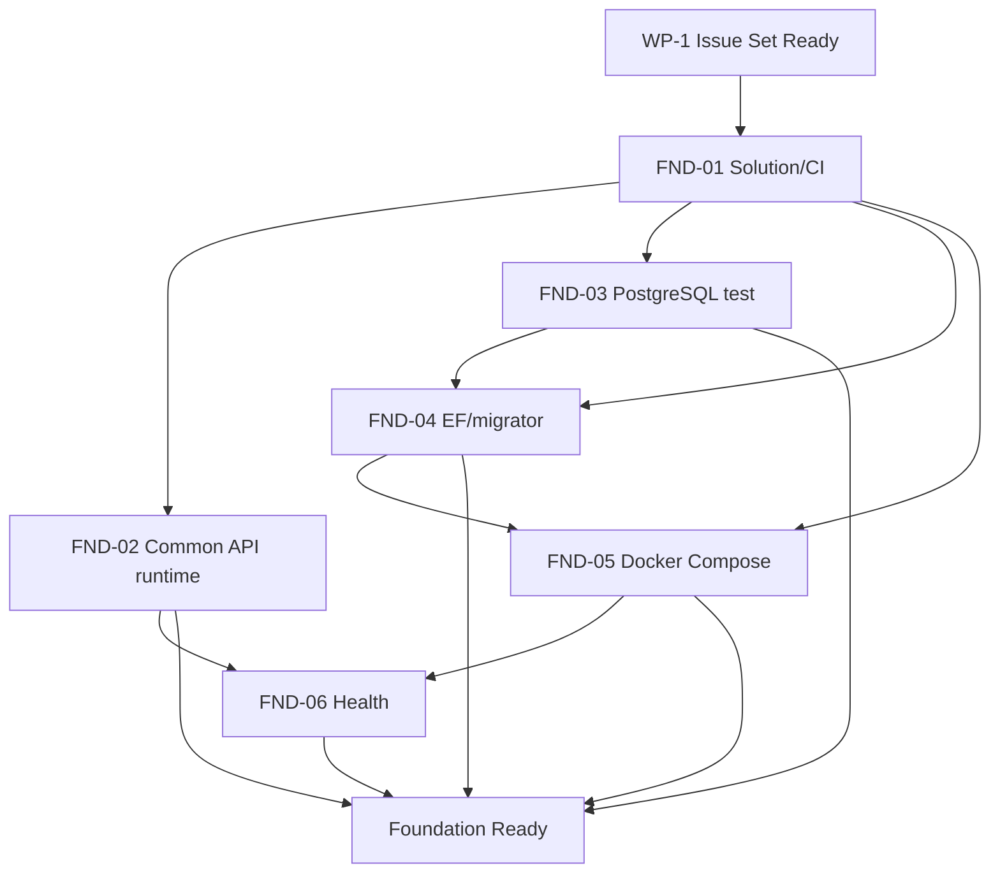

# Phase 4 実装Issue分割計画

- Status: Draft — rolling-wave revision
- Date: 2026-08-02
- Parent / Control Issue: #3
- Planning Issue: #28
- Independent Review Issue: #29
- Required gate: Architecture Ready = `PASS`
- Target gate: Implementation Ready = `NOT EVALUATED`
- Approved specification merge: `8df8caee4afcacad2c2d05b3ae39bf94217ee12b`
- Accepted architecture merge: `bb997c46e3378fd03c9aeb1dc2e59a233e3ac1c0`

## 1. 目的

承認済み製品仕様とAccepted ADR-0001〜ADR-0009を、AIエージェントが一件ずつ安全に実装・検証・独立レビューできるIssueへ段階的に分解する。

本計画は、最初から全実装Issueを詳細化しない。最初に次だけを固定する。

1. Issue設計ポリシー
2. Work Package構造
3. Work Package間の依存関係
4. 各Work Packageの開始前ゲートと完了後ゲート
5. 24 REQ、仕様AC、ADRのWork Package単位の割当
6. 直近のWP-1 Foundationに属するleaf Issue

WP-2以降のleaf Issueは、前段Work Packageで得た実装・レビュー実績を反映し、各Work Package開始前に詳細化・独立レビューする。

この方式を、本プロジェクトのローリングウェーブ型Issue分割とする。

---

## 2. この改訂で変更すること

以前の計画は21件の候補Issueを最初から詳細化していた。これは漏れ確認には有用だが、次の問題がある。

- 件数が先に固定され、責任境界より数字が優先される
- application codeがゼロの段階で後続PRの適切な粒度を過度に予測する
- 全Issueを同一階層へ並べ、途中の成熟度ゲートが弱い
- 基盤の実装結果を後続Issueへ反映しにくい
- 後続Issueの大量修正や重複Issueが発生し得る

そのため、21件は確定Issue一覧ではなく、将来の漏れ確認に使用する候補バックログへ降格する。

確定するleaf IssueはWP-1だけとする。WP-2以降はWork Packageの目的・責任・ゲート・REQ/ADR割当だけを固定する。

---

## 3. Issue設計ポリシー

### 3.1 最優先の4原則

すべてのleaf Issueは次を満たす。

1. **1 Issue = 1つのClose条件**
   - 「何ができればCloseか」を一文で説明できる。
2. **1 Issue = 1つの主責任**
   - 複数レイヤーを変更してもよいが、実現する結果は一つにする。
3. **明確なOut of scope**
   - 隣接Issueが所有する責任と、今回実施しないことを明記する。
4. **検証可能なAcceptance Criteriaと依存関係**
   - 入力、出力、状態、異常、証拠、Blocked byを具体化する。

### 3.2 必須記載項目

各leaf Issueは最低限、次の項目を持つ。

- Parent / Work Package
- Background
- Purpose / Close condition
- Authority
- Scope
- Out of scope
- Dependencies
- Owned artifacts
- Acceptance Criteria
- Verification
- Required evidence
- Agent B review focus
- Stop conditions
- Close conditions

### 3.3 分割判断の優先順位

成果物やレイヤーを機械的に分けるのではなく、次の順で判断する。

1. 一つの完了結果か
2. 一つの主責任か
3. 一つのPRで独立レビューできるか
4. 単独で検証できるか
5. 独立してmerge・rollbackできるか
6. DB、API、test等を分けるか統合するか

API、Application、Domain、Infrastructureをレイヤー別Issueにしない。vertical sliceとして一つの能力を完成させるために必要なら、複数レイヤーを一つのIssueで変更してよい。

### 3.4 分割を検討する兆候

次のいずれかがある場合は分割を検討する。

- 外部から観測できる機能が2つ以上ある
- PRの目的を一文で説明できない
- 独立してmerge・rollbackできる変更が複数ある
- 異なる専門レビューが複数必要になる
- primary ownerとなるDB objectや共通contractが無関係な責任へまたがる
- 半分だけでも独立した価値と検証結果を持つ
- Acceptance Criteriaが多く、失敗原因を一つの責任へ帰属できない

### 3.5 分けすぎの兆候

次のいずれかがある場合は統合を検討する。

- schemaだけを作り、使用する機能が存在しない
- Domain、API、Repositoryだけを別Issueにしている
- 単独では動作も検証もできない
- 常に複数Issueを同時mergeしなければ意味を持たない
- 同じAcceptance Criteriaを複数Issueが部分的に所有する
- 独立レビューしても「後続実装待ち」しか判定できない

### 3.6 大きさの目安

数時間〜2、3日、長くても1週間程度は警告指標として利用するが、固定上限にはしない。

AIエージェント開発では、日数やLOCよりも次を優先する。

- 一つの目的
- 限定された正本と責任
- 一つのDraft PR
- 一回のAgent B独立レビュー
- 明示的な自動検証
- 失敗時に安全に差分を戻せること

---

## 4. Issue単位のゲート

### 4.1 Issue Ready

leaf Issueへ着手する前に次を確認する。

- [ ] 正本が明確
- [ ] 未決の製品・設計判断がない
- [ ] 必須依存Issueと前段ゲートが完了
- [ ] Purpose / Close conditionが一つ
- [ ] Scope / Out of scopeが明確
- [ ] DB object、API contract、migration、test fixtureのownerが明確
- [ ] Acceptance Criteriaが検証可能
- [ ] 検証方法と必要証拠が定義済み
- [ ] 一つのDraft PRと独立レビューで完了可能
- [ ] Issueコメントだけで仕様・ADRを増殖させていない

一つでも未達なら着手しない。

### 4.2 Issue Done

leaf Issueをcloseする前に次を確認する。

- [ ] Acceptance Criteriaをすべて満たした
- [ ] 必須unit / API / PostgreSQL / concurrency / migration testが成功
- [ ] Agent BのBlocker / Majorが0
- [ ] 仕様・ADR・Issue scopeから逸脱していない
- [ ] テスト結果、ログ、CI等の証拠が記録済み
- [ ] 必要なtraceabilityが更新済み
- [ ] scope外の追加作業を別Issueへ分離済み
- [ ] PRがmerge済み

---

## 5. ローリングウェーブ統制

### 5.1 最初に作成するもの

Decomposition Strategy Ready通過後に次を作成する。

- 6つのWork Package統制Issue
- WP-1 Foundationのleaf Issueだけ
- WP-1の依存関係
- WP-1 Issue Set Ready評価Issue

WP-2以降のleaf Issueは作成しない。

### 5.2 後続Work Packageの詳細化

各Work Package完了後、次の順で後続を詳細化する。

1. 前段の実装・レビュー・手戻り実績を確認
2. 次のWork Packageのcapabilityを再抽出
3. leaf Issue案を作成
4. ownership、dependency、size、test strategyをセルフレビュー
5. Agent BがIssue Setを独立レビュー
6. `WP-n Issue Set Ready`を判定
7. PASSの場合のみleaf Issueへ着手

### 5.3 正式なImplementation Readyの扱い

Phase 4の正式なImplementation Readyは、WP-1のIssue Setが確定し、ローリングウェーブ統制が成立した時点で評価する。

PASSはWP-1の実装開始だけを許可する。WP-2以降のleaf Issueや実装を先取りして許可するものではない。

WP-2以降は、各`WP-n Issue Set Ready`が実装開始の追加ゲートとなる。

---

## 6. Work Package構造

```text
WP-1 Foundation
  ↓ Foundation Ready
WP-2 Security and Audit
  ↓ Security and Audit Ready
WP-3 Customer Vertical Slice
  ↓ First Vertical Slice Ready
WP-4 Money Safety Kernel
  ↓ Money Safety Ready
WP-5 Core Banking Capabilities
  ↓ Core Capabilities Ready
WP-6 Operations and Integration
  ↓ System Integration Ready
```

各Work Packageは進捗とゲートを管理する統制Issueであり、巨大な実装Issueではない。実装は配下leaf Issueで行う。

---

## 7. WP-1 Foundation

### 7.1 目的

後続機能が共通利用する最小のsolution、API契約、PostgreSQL検証基盤、migration実行経路、Docker実行環境、health contractを確立する。

WP-1ではbusiness endpoint、Identity、Customer、Account、Transaction、AuditLog、Idempotency等を実装しない。

### 7.2 開始前ゲート

`WP-1 Issue Set Ready`

- [ ] 6 leaf Issueが標準テンプレートを満たす
- [ ] 依存関係に循環がない
- [ ] 各IssueのClose条件が一つ
- [ ] FND-01とFND-02の責任が分離されている
- [ ] PostgreSQL固有検証をInMemory/SQLiteで代替しない
- [ ] migration machineryとbusiness schemaが分離されている
- [ ] Docker runtimeとhealth contractの責任が分離されている
- [ ] すべて一つのDraft PRと独立レビューで完了可能

### 7.3 WP-1 leaf Issue

#### FND-01 Solution・project・build/test CIを確立する

**Close condition**

`.NET 10` modular monolithのsolution/project境界が作成され、空の基盤状態でbuildとtest CIが成功する。

**Owns**

- solution
- API / Application / Domain / Infrastructure / Tests projects
- nullable、analyzer、format設定
- exact package patch version pin
- `dotnet restore` / `build` / `test` CI

**Out of scope**

- 共通HTTP error
- correlation ID、TimeProvider、logging
- PostgreSQL、EF Core、Docker
- business code

**Verification**

- clean checkoutでrestore/build/test成功
- project reference方向がADR-0001と整合
- application code、DB schema、business endpointが存在しない

**Dependencies**

- Blocked by: WP-1 Issue Set Ready

#### FND-02 共通API実行契約を確立する

**Close condition**

APIが共通error envelope、correlation ID、TimeProvider、JSON technical loggingを一貫して利用できる。

**Owns**

- 共通error envelope
- fixed error code mapping extension point
- correlation ID生成・伝播
- injected `TimeProvider`
- JSON console logging baseline
- secret/JWT/password等の禁止field policy

**Out of scope**

- 個別business error mapping
- Audit Log
- PostgreSQL
- health endpoint

**Verification**

- error envelope contract test
- correlation IDのrequest/response/log連携test
- deterministic time test
- prohibited fieldがlogへ出ないtest

**Dependencies**

- Blocked by: FND-01

#### FND-03 実PostgreSQL integration test基盤を確立する

**Close condition**

PostgreSQL 18を使用するintegration test fixtureが、独立したtest database lifecycleと再現可能な実行方法を提供する。

**Owns**

- PostgreSQL 18 Testcontainers fixture
- PostgreSQL image digest pin
- database作成・cleanup・isolation
- integration test category
- parallel実行方針

**Out of scope**

- DbContext
- migration
- business table
- feature test内容

**Verification**

- 複数testが相互干渉しない
- database lifecycle failureが明示的にfailする
- provider-specific testでInMemory/SQLiteを使用しない

**Dependencies**

- Blocked by: FND-01

#### FND-04 EF Core・明示的migration実行基盤を確立する

**Close condition**

EF Core/NpgsqlのDbContext baselineと明示的migratorが作成され、API startupがschemaを自動変更しないことを証明できる。

**Owns**

- DbContext baseline
- Npgsql configuration
- EF migration history
- explicit migrator / one-shot command
- API startup auto migration禁止
- empty DB apply harness
- pending model drift check

**Out of scope**

- Customer、Account、Operator、Transaction、AuditLog、Idempotency table
- business migration

**Verification**

- empty baseline databaseへmigration適用
- API startup前後でschema変更なし
- model drift checkが意図した差分を検出

**Dependencies**

- Blocked by: FND-01、FND-03

#### FND-05 Docker Compose実行基盤を確立する

**Close condition**

APIとPostgreSQLをDocker Compose v2で再現可能に起動・停止でき、secretをrepository外から注入できる。

**Owns**

- Docker Compose v2
- API / PostgreSQL services
- container image digest pin
- named volume
- secret外部注入の枠組み
- startup ordering

**Out of scope**

- health endpoint contract
- backup script
- production deployment
- business smoke test

**Verification**

- clean environmentでcompose up/down成功
- PostgreSQL volumeが意図どおり動作
- credentialがrepository、image、command logへ露出しない

**Dependencies**

- Blocked by: FND-01、FND-04

#### FND-06 live／ready health contractを実装する

**Close condition**

`/health/live`と`/health/ready`がAccepted ADRどおりの意味を持ち、Docker Compose上でDB停止時の差異を確認できる。

**Owns**

- `/health/live`
- `/health/ready`
- PostgreSQL readiness probe
- health responseの情報非露出

**Out of scope**

- business smoke test
- metrics、APM、外部監視サービス

**Verification**

- process稼働中はlive成功
- DB利用可能時はready成功
- DB停止時はlive成功、ready失敗
- connection string、exception detail非露出

**Dependencies**

- Blocked by: FND-02、FND-05

### 7.4 WP-1 dependency DAG



FND-02とFND-03はFND-01後に並行可能。FND-04はFND-03を使用し、FND-05はFND-04後、FND-06はFND-02とFND-05後に実施する。

### 7.5 完了後ゲート

`Foundation Ready`

- [ ] FND-01〜FND-06がIssue Done
- [ ] clean checkoutからbuild/test成功
- [ ] 実PostgreSQL integration testが安定実行
- [ ] explicit migratorが動作
- [ ] API startupがauto migrationしない
- [ ] Docker ComposeでAPI/PostgreSQL起動
- [ ] live/ready semanticsが正しい
- [ ] package versionとimage digestが固定
- [ ] secretがrepository/logへ露出しない
- [ ] business code、business schema、Identityを先取りしていない
- [ ] Agent BのBlocker / Majorが0

Foundation Ready PASS後にのみWP-2 leaf Issueを詳細化する。

---

## 8. WP-2 Security and Audit

### 8.1 目的

個別login、短時間JWT、現在DB状態による認可、Operator管理、Audit Log fail-closed基盤を完成させる。

### 8.2 高位capability

- ASP.NET Core Identity / Operator schema
- login / JWT issuance
- authorization-state invalidation
- current DB role authorization
- bootstrap administrator
- Operator query/create
- Operator state/role mutation
- last-admin / self-disable protection
- AuditLog schema、append-only trigger、writer
- success/rejection audit transaction integration

これは候補capability一覧であり、leaf Issueではない。Foundation Ready後に粒度を再評価する。

### 8.3 開始前ゲート

`WP-2 Issue Set Ready`

- Foundation Ready PASS
- Identity、Operator管理、Audit Logのownerが一意
- JWT失効、401/403、Audit atomicityを検証可能
- leaf Issueの粒度がFoundation実績に基づき再評価済み

### 8.4 完了後ゲート

`Security and Audit Ready`

- loginと固定role policyが動作
- disabled／stale tokenが401
- current role不足が403
- role変更後に旧JWTが使用不能
- Audit Logがappend-only
- required Audit persistence failureでfail closed
- password、JWT、raw idempotency keyを保存・logしない
- Agent B Blocker / Major 0

---

## 9. WP-3 Customer Vertical Slice

### 9.1 目的

最初のbusiness vertical sliceとして、Customer登録・Account自動開設をHTTPからPostgreSQL/Auditまで一貫して完成させ、その後Customer参照・更新を追加する。

### 9.2 高位capability

- Customer / Account aggregateとschema
- account-number sequence
- `YenAmount`利用境界
- Customer登録とAccount自動開設
- Customer参照・更新
- email normalization / uniqueness
- authorization、error、Audit、transaction統合

### 9.3 開始前ゲート

`WP-3 Issue Set Ready`

- Security and Audit Ready PASS
- Customer/Account schema ownerが一意
- 登録、参照、更新のClose条件が混在していない
- 初回vertical sliceのE2E経路が定義済み

### 9.4 完了後ゲート

`First Vertical Slice Ready`

- HTTP → auth → application → domain → PostgreSQL transaction → Audit → responseが成立
- CustomerとAccountがatomicに作成
- email uniqueness、account-number boundaryが検証済み
- Customer参照・更新の権限と異常系が仕様どおり
- 設計・DI・error mappingの重大な手戻りが残っていない
- Agent B Blocker / Major 0

---

## 10. WP-4 Money Safety Kernel

### 10.1 目的

Transaction不変性、明示的transaction、Account row lock、冪等性を、入金を参照実装として成立させる。

### 10.2 高位capability

- Transaction schema、4種類、不変性trigger
- transaction orchestration
- Account `FOR UPDATE`
- conflict mapping
- idempotency digest / advisory lock / fixed result
- Audit／idempotency atomicity
- 入金endpoint/use case
- parallel deposit、failure injection

抽象基盤だけでgateを通さない。入金で実際に利用し、成立を証明する。

### 10.3 開始前ゲート

`WP-4 Issue Set Ready`

- First Vertical Slice Ready PASS
- Transaction、lock、idempotencyのproduction ownerが一意
- 入金を参照実装として含む
- concurrency／failure injectionのownerが明確

### 10.4 完了後ゲート

`Money Safety Ready`

- 同時入金後の残高と各post-balanceが正しい
- 同じkey再送で二重更新なし
- different payload / in-progressが仕様どおり
- raw idempotency keyがdurable storage/log/backupへ存在しない
- business change、Transaction、Audit、fixed resultがatomic
- failure injectionで部分更新なし
- Agent B Blocker / Major 0

---

## 11. WP-5 Core Banking Capabilities

### 11.1 目的

Money Safety Kernelを利用して、出金、振込、解約、履歴照会を完成させる。

### 11.2 高位capability

- 通常出金
- 全額出金
- 口座間振込
- Customer/Account解約
- 解約後アクセス制御
- 取引履歴照会
- opposite-direction transfer concurrency
- closure-money concurrency

### 11.3 開始前ゲート

`WP-5 Issue Set Ready`

- Money Safety Ready PASS
- 出金、振込、解約、履歴の責任が混在していない
- transferとclosure concurrency testが明示済み
- 主要featureが一つの巨大Issueへ統合されていない

### 11.4 完了後ゲート

`Core Capabilities Ready`

- 出金で負残高なし
- 振込が両残高・両履歴をatomic更新
- lock orderとtimeoutが安全
- 解約と金銭操作の競合が安全
- 解約後アクセス制御が仕様どおり
- 履歴順序、必須項目、0件応答が仕様どおり
- Agent B Blocker / Major 0

---

## 12. WP-6 Operations and Integration

### 12.1 目的

backup/restore、migration upgrade/rollback、Docker E2E、smoke、traceability closureを完成させる。

### 12.2 高位capability

- protected `pg_dump` / `pg_restore`
- clean restore
- empty-to-latest migration
- previous-to-latest migration
- safe Down / backup restore
- previous app/schema compatibility
- Docker Compose E2E
- representative user journey smoke
- Requirement → Issue → PR → Test evidence closure

### 12.3 開始前ゲート

`WP-6 Issue Set Ready`

- Core Capabilities Ready PASS
- backup、migration、E2E、traceabilityの責任が分離
- final validationがfeature test不足を埋めるcatch-allになっていない

### 12.4 完了後ゲート

`System Integration Ready`

- clean environmentで起動
- migrationを空DB・旧DBから適用
- backupからrestoreしsmoke成功
- 全24 REQと仕様ACが実装Issue/PR/testへ追跡
- feature固有testを最終Issueへ丸投げしていない
- Agent B Blocker / Major 0

---

## 13. Phase 4のゲート

### Gate 4-A: Decomposition Strategy Ready

PR #31の対象ゲート。

- Issue設計ポリシーが明確
- Work Package構造とゲートが妥当
- rolling-wave方式が明確
- WP-1 leaf Issueだけが詳細化されている
- WP-2以降を確定しすぎていない
- 24 REQ、AC、ADRがWork Packageへ割り当てられている
- Agent B Blocker / Major 0

PASS後にWork Package統制IssueとWP-1 leaf Issueを作成する。

### Gate 4-B: WP-1 Issue Set Ready

実際に作成したWP-1 leaf Issue群の品質を確認する。

- 標準テンプレート準拠
- Close条件が一つ
- ownershipとdependencyが明確
- ACとVerificationが具体的
- 循環なし
- Agent B Blocker / Major 0

### Formal Gate: Implementation Ready

Decomposition Strategy ReadyとWP-1 Issue Set ReadyがPASSした後に別工程で評価する。

PASSはWP-1実装だけを許可する。WP-2以降は各Issue Set Readyまで着手禁止とする。

---

## 14. Work Package単位のREQ割当

| Requirement | Primary Work Package | Integration / final verification |
| --- | --- | --- |
| REQ-DOM-001 | WP-3 | WP-6 |
| REQ-DOM-002 | WP-3 / WP-5 | WP-6 |
| REQ-DOM-003 | WP-3 / WP-5 | WP-6 |
| REQ-DOM-004 | WP-4 / WP-5 | WP-6 |
| REQ-DOM-005 | WP-4 / WP-5 | WP-6 |
| REQ-CUS-001 | WP-3 | WP-6 |
| REQ-CUS-002 | WP-3 | WP-6 |
| REQ-CUS-003 | WP-3 | WP-6 |
| REQ-CUS-004 | WP-3 | WP-6 |
| REQ-CUS-005 | WP-5 | WP-6 |
| REQ-CUS-006 | WP-5 | WP-6 |
| REQ-DEP-001 | WP-4 | WP-6 |
| REQ-WDR-001 | WP-5 | WP-6 |
| REQ-WDR-002 | WP-5 | WP-6 |
| REQ-WDR-003 | WP-5 | WP-6 |
| REQ-WDR-004 | WP-5 | WP-6 |
| REQ-TRF-001 | WP-5 | WP-6 |
| REQ-TRF-002 | WP-5 | WP-6 |
| REQ-TRF-003 | WP-5 | WP-6 |
| REQ-TRF-004 | WP-4 / WP-5 | WP-6 |
| REQ-HIS-001 | WP-5 | WP-6 |
| REQ-HIS-002 | WP-4 / WP-5 | WP-6 |
| REQ-CON-001 | WP-4 / WP-5 | WP-6 |
| REQ-VAL-001 | WP-1〜WP-5 | WP-6 traceability closure |

leaf Issue単位の割当は各Work PackageのIssue Set Ready時に確定する。

---

## 15. Work Package単位のAC割当

| AC group | Primary Work Package |
| --- | --- |
| AC-CUS-001〜007 | WP-3 |
| AC-CLS-001〜008 | WP-5 |
| AC-CLOSED-001〜005 | WP-5 |
| AC-DEP-001〜008 | WP-4 |
| AC-WDR-001〜009 | WP-5 |
| AC-TRF-001〜013 | WP-5（安全基盤はWP-4） |
| AC-HIS-001〜007 | WP-5 |
| AC-AUTH-001〜004 | WP-2 |
| AC-USER-001〜009 | WP-2 |
| AC-IDEM-001〜008 | WP-4 |
| AC-CON-001〜003 | WP-4 / WP-5 |
| AC-ERR-001 | WP-1 contract、WP-2〜5 mappings |
| AC-OPS-001 | WP-1 |
| AC-OPS-002〜005、007 | WP-2 + state-changing Work Packages |
| AC-OPS-006 | WP-6 |

---

## 16. Work Package単位のADR割当

| ADR | Primary Work Package | Integration / verification |
| --- | --- | --- |
| ADR-0001 Platform baseline | WP-1 | all |
| ADR-0002 Money representation | WP-3 / WP-4 | WP-5 |
| ADR-0003 Transaction boundaries | WP-3 / WP-4 | WP-2 / WP-5 |
| ADR-0004 Concurrency / row lock | WP-4 | WP-5 |
| ADR-0005 Idempotency | WP-4 | WP-5 |
| ADR-0006 Persistence / IDs / time | WP-2 / WP-3 / WP-4 | WP-5 |
| ADR-0007 Authentication / authorization | WP-2 | WP-3〜5 |
| ADR-0008 Audit / logging / backup | WP-1 / WP-2 / WP-6 | WP-3〜5 |
| ADR-0009 Migration / rollback | WP-1 machinery / WP-6 validation | schema-owning WPs |

---

## 17. テスト戦略

| Test type | Primary timing | Rule |
| --- | --- | --- |
| Domain unit | owning leaf Issue | pure business rulesと境界値 |
| API integration | owning vertical Issue | auth、HTTP、error contract |
| PostgreSQL integration | schema/transaction owning Issue | constraint、trigger、transaction、raw SQL |
| Concurrency | WP-4 / WP-5 owning Issue | row lock、advisory lock、deadlock、timeout |
| Failure injection | transaction/Audit/idempotency owner | atomicityとfail-closed |
| Migration | schema owner + WP-6 | issue-local upgrade + cross-version validation |
| Docker E2E | WP-6 | 接続・代表journeyのみ |
| Manual evidence | 必要なIssueのみ | 自動化不能なrelease/operation確認 |

最終E2Eへ主要feature testを丸投げしない。provider固有挙動をInMemory/SQLiteで代替しない。

---

## 18. 標準leaf Issueテンプレート

```markdown
Refs #3
Parent Work Package: #TBD

## Background

## Purpose / Close condition
このIssueは、○○が△△できる状態を実現した時点で完了する。

## Authority
- Specification:
- Acceptance Criteria:
- Accepted ADR:

## Scope

## Out of scope

## Dependencies
- Blocked by:
- Depends on:
- Can run in parallel with:

## Owned artifacts
- API contract:
- Domain/Application responsibility:
- DB objects:
- Migration:
- Test fixtures:

## Acceptance Criteria
- [ ]

## Verification
- Unit:
- API integration:
- PostgreSQL integration:
- Concurrency/failure injection:
- Manual:

## Required evidence
- Test results:
- CI:
- Logs/screenshots where required:

## Agent B review focus

## Stop conditions

## Close conditions
- [ ] Acceptance Criteria achieved
- [ ] Required tests passed
- [ ] Agent B Blocker/Major 0
- [ ] Evidence recorded
- [ ] PR merged
```

---

## 19. 将来候補バックログの扱い

以前の21候補は削除せず、漏れ確認用の参考カテゴリとして次へ整理する。

- Foundation: solution、API runtime、PostgreSQL test、EF/migration、Compose、health
- Security/Audit: auth、Operator、Audit
- Customer: registration、query/update、closure
- Money: Transaction、transaction/lock、idempotency、deposit、withdrawal、transfer
- Query: history
- Operations: backup、migration validation、E2E/traceability

これらはGitHub Issueでも確定leaf Issueでもない。各Work Package開始前に統合・分割・削除を再判断する。

---

## 20. 本計画のAcceptance Criteria

- [ ] Issue数を先に固定していない
- [ ] 1 Issue = 1 Close条件 / 1主責任をポリシー化した
- [ ] Issue Ready / Issue Doneを定義した
- [ ] 6 Work Packageと開始・完了ゲートを定義した
- [ ] ローリングウェーブでWP-1だけを詳細化した
- [ ] WP-1 leaf Issueのresponsibilityとdependencyが明確
- [ ] FND-01の過大scopeを分割した
- [ ] Docker runtimeとhealth contractを分離した
- [ ] 24 REQがWork Packageへ追跡される
- [ ] 仕様AC groupがWork Packageへ追跡される
- [ ] ADR-0001〜0009がWork Packageへ追跡される
- [ ] PostgreSQL固有挙動は実PostgreSQL testへ割り当てた
- [ ] final E2Eをcatch-allにしていない
- [ ] Implementation ReadyをWP-1限定の開始許可として明確化した
- [ ] WP-2以降のleaf Issueを先取りしていない
- [ ] application code、schema、migration、Docker実装を開始していない

---

## 21. 現在の停止点

次はPR #31の改訂計画をAgent Bが独立レビューし、`Decomposition Strategy Ready`を判定する。

PASSとなるまで、次を行わない。

- Work Package統制Issueの作成
- WP-1 leaf Issueの作成
- WP-1 Issue Set Ready判定
- Implementation Ready判定
- application code、schema、migration、Docker実装

レビューでPASSとなった場合、6 Work Package統制IssueとWP-1 leaf Issueだけを作成する。WP-2以降のleaf Issueは各前段ゲート後に作成する。
